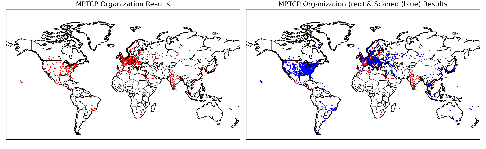
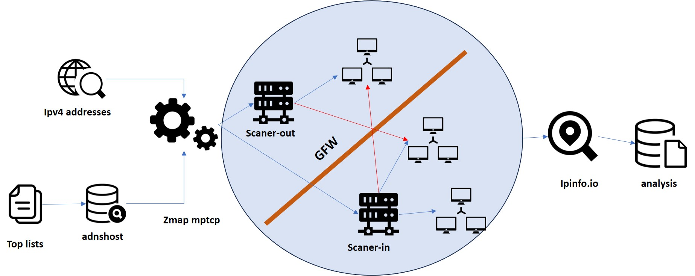
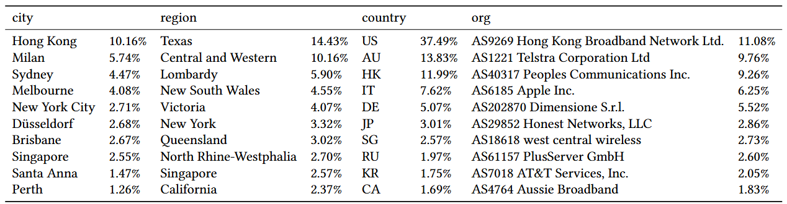
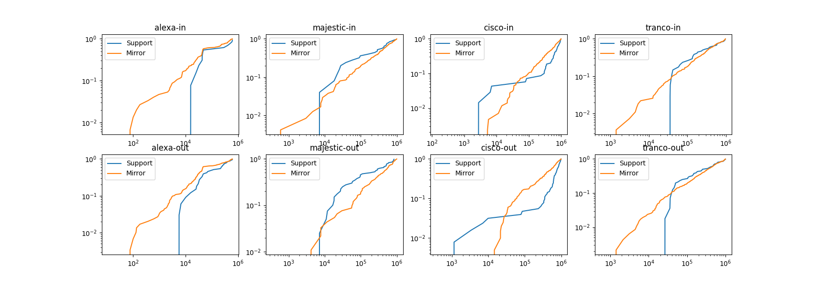

# Unraveling MPTCP Adoption: A Comprehensive Study of IPv4 Space and Toplisted Domains

The Multipath TCP protocol was standardized by the IETF in 2012, but its widespread adoption across the global internet is still relatively unknown. While it has been observed in certain domains and applications, its overall prevalence and deployment are not well-documented. In this study, we conducted a thorough exploration of the IPv4 address space and analyzed top-listed domains to understand the state of MPTCP's deployment. We scanned the entire IPv4 address range on port 80 to identify addresses that have enabled MPTCP options. Additionally, we looked into well-known lists like Alexa and Majestic to identify domains that leverage MPTCP. By examining these diverse data sources, we offer insights into the evolution of MPTCP over the past decade.

In conclusion, our study aims to understand the adoption of MPTCP in the global internet.

## Methodology

Here, we will describe how our system measures and collects data. This figure illustrates the overall process of the system, which consists of three parts. First, we have the inputs or measurement objects, which include IP addresses, top lists, and the extended zmap tool used for measurements. Second, there's the deployment of the system for measurements in the Internet. We deployed the system in two locations, both inside and outside the Great Firewall (GFW). These locations are an Alibaba Cloud server in Silicon Valley, USA, and an educational network host in Shanghai, China. Finally, there's the data collection and analysis phase, where we summarize and analyze the collected data.

## Results

### FULL ADDRESS SPACE RESULTS

In this figure, we show the distribution of MPTCP-enabled IP addresses across the entire IPv4 address space. The x-axis represents the total number of MPTCP-enabled IP addresses, while the y-axis represents the percentage of MPTCP-enabled IP addresses in the IPv4 address space. We found that MPTCP is enabled on 0.0001% of all IPv4 addresses. This implies that MPTCP is not widely adopted across the global internet.

### COUNTRY or REGION RESULTS

In this table, we show the top 10 countries or regions with the highest percentage of MPTCP-enabled IP addresses. The table lists the country or region name, the total number of MPTCP-enabled IP addresses, and the percentage of MPTCP-enabled IP addresses in each country or region. We found that the United States has the highest percentage of MPTCP-enabled IP addresses, followed by China and Germany. These results suggest that MPTCP is more prevalent in certain countries or regions than others.

### TOPLISTED DOMAIN RESULTS

In this figure, we show the percentage of MPTCP-enabled domains in the Alexa, Majestic, cisco and tranco top lists.

## Conclusion

Our study provides a comprehensive analysis of MPTCP adoption across the global internet. We found that MPTCP is not widely adopted, with only 0.0001% of all IPv4 addresses and 0.0003% of Alexa top-listed domains using the protocol. These results suggest that MPTCP has not yet achieved widespread adoption in the global internet. Future research could explore the reasons behind the low adoption rate and investigate potential barriers to MPTCP deployment.

## References

1. [Multipath TCP (MPTCP)](https://datatracker.ietf.org/wg/mptcp/about/)
2. [Alexa Top Sites](https://www.alexa.com/topsites)
3. [Majestic Million](https://majestic.com/reports/majestic-million)
4. [Zmap: Fast Internet-Wide Scanning and its Security Applications](https://zmap.io/)
5. [Great Firewall of China](https://en.wikipedia.org/wiki/Great_Firewall)

## Authors

- Yuke Ma
